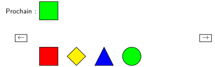
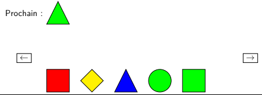
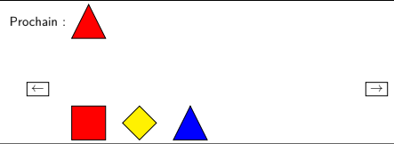

# Tetris Game

## Description

### 3.1 Pieces and Board

A piece of the game will be characterized by a color and a shape. Colors will be Blue, Yellow, Red, and Green. Shapes will be Square, Diamond ♦, Circle, and Triangle.

The "board" of the game will simply be a straight line, extendable from left to right.

### 3.2 Piece Insertions

At each step, the game randomly generates a new piece, which the player must insert on the game board. For example, suppose the following configuration:



In this example, the four bottom pieces are already placed on the game board. The player must now place the new piece, the green square. He has two possibilities: either to the left, before the red square, or to the right, after the green circle.

If three consecutive pieces have the same color or shape, then the three pieces disappear from the game board. For example, if the player chooses to place the green square to the right, and then chooses to place the next piece, the green triangle, to the right:



The game board will change to the following configuration (as the three consecutive green pieces present have disappeared):



### 3.3 Shifts

In addition to insertions to the left or right, the player can choose to make shifts in order to make deletions otherwise unattainable. Indeed, we propose the possibility of shifting all pieces of a certain shape to the left, or shifting all pieces of a certain color to the left.

### 3.4 Chaining of Pieces

The pieces are linked together by a simple circular linked list made up of multiple player insertions (blue list). By keeping a pointer to the last one, we facilitate insertions to the left or right. Each piece knows the previous and next pieces having the same shape as itself. Thus, square pieces (resp. diamonds, triangles, circles) are linked together by a doubly circular linked list (in red). Each piece knows the previous and next pieces having the same color as itself. Thus, red pieces (resp. yellow, green, blue) are linked together by a doubly circular linked list (in black). These last two linkages facilitate shifts to the left.

## How to Run

To run the Tetris Game project, follow these steps:

1. Ensure you have a C++ compiler installed, such as g++.
2. Navigate to the project directory containing the Makefile.
3. Open a terminal or command prompt in this directory.
4. Run the following command to compile the project:

   ```bash
   make run
   ```
